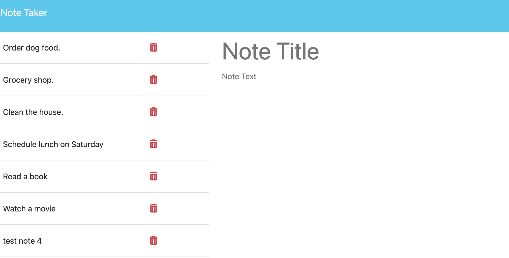

# Note Taker 

## Description

This page allows a user to enter notes and tasks to help with organization.

## Acceptance Criteria

It is done when...

I open the note taking page, I am presented with a landing page,

The lading page links to a notes page,

I am presented  with a page with existing notes listed in the left-hand column, plus empty fields to enter a new note title and the note’s text in the right-hand column,

When I enter a new note, I chave the option to save the note or clear the page,

If I choose to save the new note, it is saved and appears in the left-hand column with the other existing notes and the buttons in the navigation disappear.

When I click on an existing note in the list in the left-hand column, that note appears in the right-hand column and a "New Note" button appears in the navigation

When I click on the "New Note" button in the navigation at the top of the page, I am presented with empty fields to enter a new note title and the note’s text in the right-hand column and the button disappears

## Page

https://dariapressley.github.io/notetaker/

## Github

https://github.com/DariaPressley/notetaker

## Credits

Eric Sayer (UCLA Tutor) for overall guidance with Javascript.

## License

Please refer to the LICENSE in the repo.

